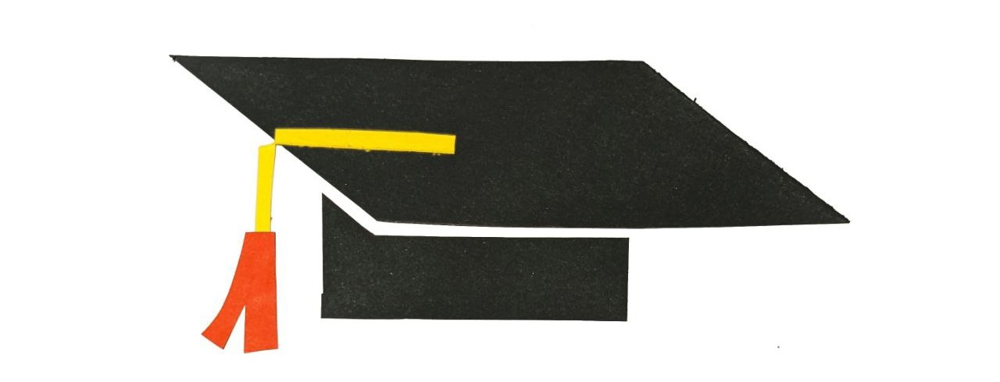

> This is a ChatGPT translation that was not properly verified by any human being.

After Classes is a series of long reads about all kinds of things that happened to me during my undergraduate years at Moscow’s Higher School of Economics from 2019 to 2023. A lot happened — I started a blog, became a political activist, got my first job, got married, emigrated, and kept studying the entire time.

<!--more-->
---

**Table of contents:**

* [Studies and HSE](/after-classes/studies-and-hse/). How HSE is organized, the learning process, and how I was dying while trying to balance classes and work.
* [Friends and the Internet](/after-studies/friends-and-internet/). How friendships became much more complicated, against all expectations. And my leap into the open internet.
* [Loves and Breakups](/loves-and-breakups/). All of my romantic adventures, scandals, and intrigues!!!
* [Work and Teaching](/after-classes/teaching-and-working/). What to do outside of university and burning out from work by age 21.
* [Protests and Emigration](/after-classes/protests-and-emigration/). My problems with Russia, and Russia’s problems with me.

